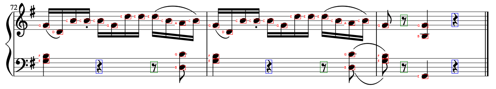

# Assignment 1: Image Processing and Recognition Basics
#### by: Andrew Corum, Josep Han, Kenneth Zhang, Zheng Chen
#### 03/29/2021

 <!-- Your report should explain how to run your code
and any design decisions or other assumptions you made -->

To run the code: in the command line, run either: 

<!-- ```python3 omr.py ./images/music1.png hamming``` -->
```python3 ./omr.py <file> hamming```
to run the hamming distance method, or 
```python3 ./omr.py <file> d_matrix```
to run the d_matrix method.

```<file>``` is the location of the music sheet.


The outputs should be two files: 

```detected.png , detected.txt```



### Design Decisions and Assumptions
As the assignment states, we assume that the music lines from the image are parallel and straight. This is in order to implement the Hough Transform for line detection. We also assumed that every lines are in treble clef. This is because the assignment did not provide a template model for treble or bass clefs. 

When applying convolutions, we assumed that the padding of the image should repeat the values found at the edges. This prevented the darkened halo effect on our template images as well as the music sheets when applying Gaussians or Sobel kernels.

When detecting the staff lines, we decided to implement a naive thresholding, where if the pixel value is less than 78% (100% being white), then we convert that pixel to 0. This significantly helped the Hough Transform algorithm as there were less ambiguous pixels when applying the Sobel operator and non-maximal suppression.

### Performance of algorithms
#### Convolution
We have tested with Sobel operators and Gaussians, and the results looked identical to code packages from CV2. Since we made it compatible with separable 1D kernels, it is safe to assume that the runtime performance should be improved over 2D kernels.

#### Hamming Distance


#### Template Matching
The Hamming Distance calculation was not hard to implement, since it checks every pixel of the template with the given area of the image, much like convolution. However, we noticed that this would result in a less accurate note detection, where things like the circle in the treble clef would count as a note. 

The alternate approach suggested we take the edge maps of the image and templates before calculating the template matching values in a slightly different way. We found that this implementation is much slower compared to the Hamming distance method. But the accuracy of the template matching seems to perform better than with Hamming Distance on noisier images, like music3.png. On the other hand, Hamming performed better on music1.png in our experiments. It appears that third interval note pairs do not perform well for the D_matrix.


#### NJIT 
Early in our work, we noticed that our code would not run as quickly as we thought it should, even with algorithm optimizations made such as using separable kernels during convolution. We discovered that in our work, numba's njit could help apply a JIT compiler to our code to increase the computation speed.

Here are some computation time comparisons:

Hamming Distance Time (in seconds)|No NJIT|With NJIT| % changed
------------ | ------------ | -------------|---------------
music1|84.35875154|0.0849998 | 992.4582388%
music2|158.1897514|0.14099884 | 1121.922358%
rach|N/A|0.708999872 | N/A

In row 1, you can see that there is 

D_Matrix time (in seconds) |No NJIT|With NJIT
------------ | ------------ | -------------
music1|~20 minutes|87.13685417175293

Evidently, NJIT was highly instrumental in allowing our code to run in manageable time.

### Future Work
The first thing we could look at to improve is to provide a way to detect the clefs of each staff. This would make the note detection more consistent to the true values. 

We could also experiment with different threshold values that the user could adjust when applying on different images.